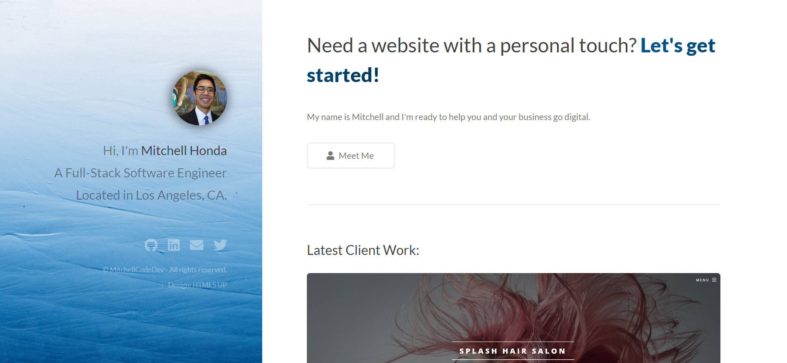
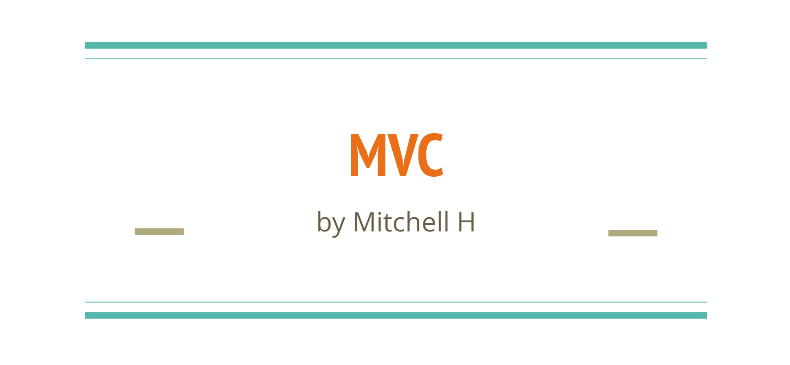

<!-- 

  -->

<h2 align="center">Hi! I'm Mitchell! I'm a Full-Stack Software Engineer.</h2>

 

  
  

 

I'm a Los Angeles software engineer proficient in both Frontend development and Backend development. I have extensive knowledge in <strong style="color: #3F82B9"> HTML, CSS, Javascript, MongoDB, and React. </strong> As a software engineer, I build responsive websites that suit the wants and needs of my clients and am eager to solve problems through innovative solutions and collaboration.

All of my projects are available [here](https://mitchellh.netlify.app/). You can reach me @ helloMitchellH@gmail.com.

 

 

 

<h2 align='center'>My Skill Set</h2>

<table><tr><td valign="top" width="50%">

<h3 align='center'>Frontend<h3>   

  
  
  
  
  

</td><td valign="top" width="50%">

<h3 align='center'>Backend<h3>   

  
  
  
  
  

  

</td></tr></table>

 

 

<h2 align="center" color="white">Projects</h2>

	<table>
		<tr>
			<td width="50%">
				<h3 align="center" color="white">Star Treck App & API</h2>
				
  
					
					 
					 
					

						  
							
					

					
<strong>Node.js, Express, JavaScript, CSS3, HTML5</strong> - App that gives you facts about Star Trek's Aliens!

				

			</td>
			<td width="50%">
				<h3 align="center" color="white">Personal Portfolio</h2>
				
  
					
					 
					 
					

						  
							
					

					 
<strong>JavaScript, CSS3, HTML5</strong> - Portfolio Site including links to my projects and ways to get in contact with me.

        		

			</td>
		</tr>
		<tr>
			<td width="50%">
				<h3 align="center" color="white">MVC - Lecture</h2>
				
  
					
					 
					 
					

						  
							
					

					
<strong>Architectural Paradigm Lecture</strong> - Software Engineering presentation slides covering MVC (Model, View, Controller)

				

			</td>
			<td width="50%">
				<!-- <h3 align="center" color="white">Personal Portfolio</h2>
				
  
					
					 
					 
					

						  
							
					

					 
<strong>JavaScript, CSS3, HTML5</strong> - Portfolio Site including links to my projects and ways to get in contact with me.

        		
 -->
			</td>
		</tr>
			<!-- <tr>
			<td width="50%">
				<h3 align="center" color="white">King's Cup</h2>
				
  
					
					 
					 
					

						  
							
					

					
<strong>JavaScript, CSS3, HTML5</strong> - Online game to play with friends!

				

			</td>
			<td width="50%">
				<h3 align="center" color="white">To Do App</h2>
				
  
					
					 
					 
					

						  
							
					

					 
<strong>Node.js, Express, MongoDB</strong> - To Do App

				

			</td> -->
	</table>

 

 
<h2 align="center">Connect with me</h2>

  
  

 

